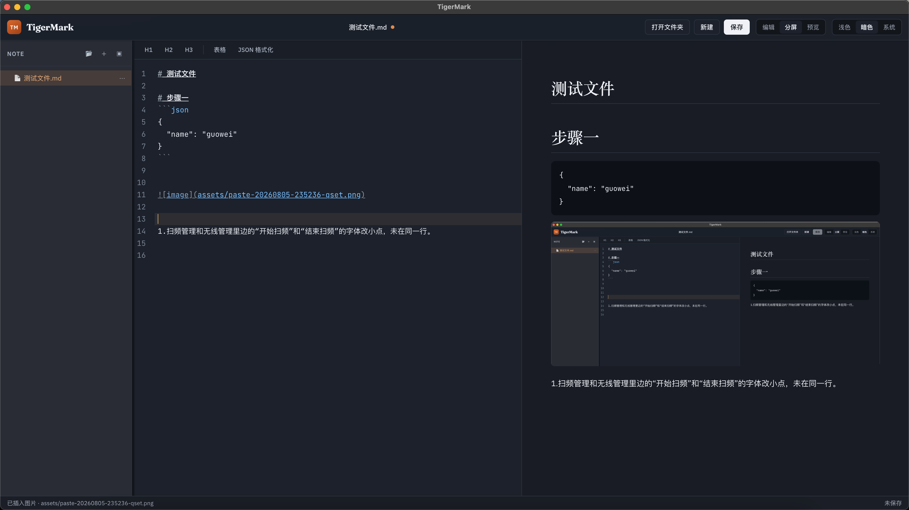

# TigerMark

跨平台桌面 Markdown 编辑器，本地优先、轻量干净。

支持 **macOS / Windows / Linux**，基于 Tauri 2 + React + CodeMirror 构建。

> 仓库：[Gitee · pytiger/tigermark](https://gitee.com/pytiger/tigermark)

---

## 特性

- **本地文件夹工作区** — 打开任意本地目录，以树形结构管理 Markdown 与子文件夹
- **文件操作** — 新建文件 / 文件夹、重命名、删除；侧边栏与菜单均可操作
- **实时编辑与预览** — CodeMirror 编辑器 + GFM 预览；支持仅编辑 / 分屏 / 仅预览
- **粘贴图片** — 从剪贴板粘贴图片，自动保存到文档旁 `assets/` 并插入 Markdown 语法
- **编辑工具栏** — 一键插入 H1–H3（标题单独成行）、表格；选中或定位后格式化 JSON
- **自动标题换行** — 在行内输入 `# ` / `## ` 等时，自动将标题推到独立一行
- **快捷键与菜单** — 打开、保存、视图切换等常用操作

粘贴产生的 `assets` 目录会从侧边栏隐藏，避免附件干扰文档列表；图片仍正常预览。

---

## 截图



---

## 环境要求

- [Node.js](https://nodejs.org/) **18+**（建议 LTS）
- npm 9+（或兼容的包管理器）
- [Rust](https://www.rust-lang.org/) **1.77.2+**（建议通过 [rustup](https://rustup.rs/) 安装）
- macOS 还需 Xcode Command Line Tools

本仓库默认 `.npmrc` 使用国内镜像（npmmirror）。若你在海外或使用自有镜像，可删除或调整 `.npmrc`。

---

## 快速开始

### 安装依赖

```bash
git clone https://gitee.com/pytiger/tigermark.git
cd tigermark
npm install
```

### 开发模式

```bash
npm run dev
```

将启动 Vite 开发服务并拉起 Tauri 窗口，支持热更新。仅启动前端可用 `npm run dev:vite`。

### 类型检查与前端构建

```bash
npm run build
```

### 打包安装包

打包前设置签名私钥（用于自动更新产物），例如：

```bash
export TAURI_SIGNING_PRIVATE_KEY="$HOME/.tauri/tigermark.key"
export TAURI_SIGNING_PRIVATE_KEY_PASSWORD=""
npm run dist
```

产物输出到 `src-tauri/target/release/bundle/`：

| 平台 | 产物示例 |
|------|----------|
| macOS | `.app` / `.dmg`，以及 updater 用的 `.app.tar.gz` + `.sig` |
| Windows | NSIS / MSI，以及对应 `.sig` |
| Linux | AppImage / `.deb`，以及对应 `.sig` |

请在对应操作系统上执行打包，以生成该平台安装包。

### 自动更新 feed

客户端从 `https://www.pytiger.com/tigermark/updates/latest.json` 检查更新，格式见 [`docs/updater-latest.example.json`](docs/updater-latest.example.json)。

1. `npm run dist` 后把安装包和 `.sig` 上传到该目录
2. 把 `.sig` 文件内容填进 `latest.json` 对应平台的 `signature`
3. 覆盖发布 `latest.json`

旧的 electron-updater `latest.yml` 已不再使用。私钥保存在本机 `~/.tauri/tigermark.key`，**不要提交到仓库**；丢失后已安装用户将无法接收后续更新。

### 用 Gitee 发行版提供下载

1. 打标签并推送：`git tag v1.0.0 && git push origin v1.0.0`
2. 仓库页 → **发行版** → **创建发行版**，选择该 Tag
3. 上传安装包作为附件

也可启用 **Gitee Go 流水线** 自动打 Linux 包并上传发行版，配置模板见 [`.gitee/pipelines/release-linux.yml`](.gitee/pipelines/release-linux.yml)。流水线需配置密钥 `TAURI_SIGNING_PRIVATE_KEY`（私钥内容或文件路径）。

### Gitee Go 接入步骤（简要）

1. 打开仓库 → **流水线 / Gitee Go** → 新建流水线
2. 选择 **YAML 配置**，粘贴 `.gitee/pipelines/release-linux.yml` 内容
3. 触发条件设为推送 `v*` Tag
4. 推送例如 `v1.0.0` 后查看构建与发行版附件

> 云端一般为 Linux，只能自动产出 AppImage / deb。macOS / Windows 包仍需本机 `npm run dist` 后手动挂到同一发行版。

---

## 使用说明

1. 启动应用后，点击 **打开文件夹**（或 `Ctrl/⌘ + O`）选择笔记目录
2. 在左侧选择或新建 `.md` 文件开始编辑
3. 使用顶部视图切换：**编辑 / 分屏 / 预览**
4. 复制图片后在编辑器中 `Ctrl/⌘ + V` 粘贴
5. 使用编辑区工具栏插入标题、表格，或格式化 JSON

示例文档见 [`examples/welcome.md`](examples/welcome.md)。

### 快捷键

| 快捷键 | 功能 |
|--------|------|
| `Ctrl/⌘ + O` | 打开文件夹 |
| `Ctrl/⌘ + S` | 保存当前文件 |
| `Ctrl/⌘ + 1` | 仅编辑 |
| `Ctrl/⌘ + 2` | 分屏 |
| `Ctrl/⌘ + 3` | 仅预览 |

---

## 项目结构

```text
tigermark/
├── src-tauri/          # Tauri 2 桌面壳
│   ├── src/            # Rust 命令、菜单、自动更新
│   ├── capabilities/   # 权限
│   └── tauri.conf.json
├── src/
│   ├── desktop/        # 前端 bridge（window.tigermark）
│   ├── App.tsx         # 应用主界面与状态
│   ├── components/     # 编辑器、预览、文件树、工具栏等
│   ├── editor/         # 编辑器命令（标题、表格、JSON）
│   ├── styles.css
│   └── main.tsx
├── examples/           # 示例 Markdown
├── index.html
├── vite.config.ts
└── package.json
```

---

## 技术栈

| 层级 | 技术 |
|------|------|
| 桌面壳 | Tauri 2 |
| 构建 | Vite 6 · Cargo |
| UI | React 19 · TypeScript |
| 编辑器 | CodeMirror 6 |
| 预览 | marked · DOMPurify |

---

## 路线图（欢迎 PR）

- [ ] 更多 Markdown 快捷插入（链接、代码块、任务列表等）
- [ ] 主题 / 外观设置
- [ ] 全文搜索与文件内搜索
- [ ] 导出 HTML / PDF
- [ ] 自动保存与未保存提示增强
- [ ] CI 多平台自动构建与 Release

---

## 参与贡献

欢迎 Issue 与 Pull Request。

1. Fork 本仓库并创建分支：`git checkout -b feature/your-feature`
2. 提交改动并推送到你的 Fork
3. 发起 Pull Request，说明动机与验证方式

提交前建议执行：

```bash
npm run build
```

---

## 许可证

[MIT](LICENSE) © TigerMark contributors
